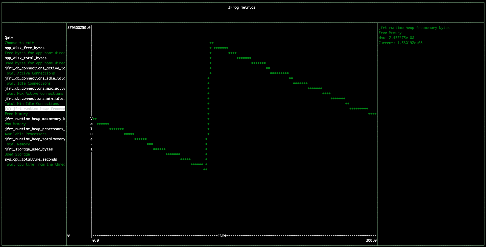
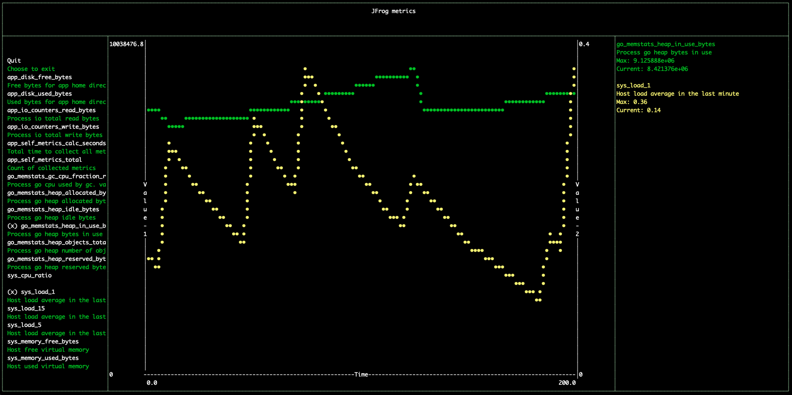

# JFrog CLI metrics-viewer Plugin
A plugin or standalone binary to show [open-metrics](https://openmetrics.io/) formatted data in a terminal based graph.



## About this plugin
This JFrog CLI plugin is for viewing JFrog products metrics in real time in a terminal. 

## Building from source
To build the **metrics-viewer** binary
```shell
go build .
```

## Building a Docker image
To build the **metrics-viewer** into a Docker image and use it
```shell
# Build the Docker image
docker build -t metrics-viewer:0.1 .

# Test the Docker image
docker run --rm --name metrics-viewer metrics-viewer:0.1 --version
```

## Installation of local binary with JFrog CLI
Since this plugin is currently not included in [JFrog CLI Plugins Registry](https://github.com/jfrog/jfrog-cli-plugins-reg), it needs to be built and installed manually. Follow these steps to install and use this plugin with JFrog CLI.
1. Make sure JFrog CLI is installed on you machine by running ```jfrog```. If it is not installed, [install](https://jfrog.com/getcli/) it.
2. Create a directory named ```plugins``` under ```~/.jfrog/``` if it does not exist already.
3. Clone this repository.
4. CD into the root directory of the cloned project.
5. Run ```go build``` to create the binary in the current directory.
6. Copy the binary into the ```~/.jfrog/plugins``` directory.

## Installation with JFrog CLI (when plugin is in the JFrog CLI Plugins Registry)
Installing the latest version:
```shell
jfrog plugin install metrics-viewer
```

Installing a specific version:
```shell
jfrog plugin install metrics-viewer@version
```

Uninstalling a plugin
```shell
jfrog plugin uninstall metrics-viewer
```

## Artifactory Metrics
You can view [Artifactory Metrics](https://www.jfrog.com/confluence/display/JFROG/Open+Metrics) in various ways.
To try it out, you can run Artifactory as Docker container.

* Start Artifactory as Docker container and enable its metrics
```shell
docker run --rm -d --name artifactory \
    -p 8082:8082 \
    -e JF_ARTIFACTORY_METRICS_ENABLED=true \
    -v $(pwd)/artifactory:/var/opt/jfrog/artifactory/ docker.bintray.io/jfrog/artifactory-oss
```

* Once Artifactory is up, you can see the metrics log file or [REST API endpoint](https://www.jfrog.com/confluence/display/JFROG/Artifactory+REST+API#ArtifactoryRESTAPI-GettheOpenMetricsforArtifactory)
```shell
# See the metrics log files
cat artifactory/log/artifactory-metrics.log
cat artifactory/log/metadata-metrics.log

# Get the metrics from Artifactory REST API
curl -s -uadmin:password http://localhost:8082/artifactory/api/v1/metrics
```

## Usage
### Commands
The **metrics-viewer** can be run as a JFrog CLI Plugin or directly as a binary
- **Usage**
```shell
./metrics-viewer <command> [options]
```  

- **Commands**: See available commands by just running the binary
```shell
./metrics-viewer
./metrics-viewer help
```

- **Options**: To see available options for each command, call it with the help
```shell
./metrics-viewer help graph 
./metrics-viewer help print 
```

### Examples
- Using the **metrics-viewer** binary
```shell
# Use with preconfigured Artifactory (will show Artifactory metrics)
./metrics-viewer graph --artifactory

# Use with direct Artifactory metrics API URL
./metrics-viewer graph --url http://localhost:8082/artifactory/api/v1/metrics --user admin --password password

# Use with direct Metadata metrics API URL (NOTE: must get an access token from Artifactory)
./metrics-viewer graph --url http://localhost:8082/metadata/api/v1/metrics --token ${TOKEN}

# Print metrics with preconfigured Artifactory (will show Artifactory metrics)
./metrics-viewer print --artifactory

# Print metrics with preconfigured Artifactory with name matching the "app_" filter
./metrics-viewer print --artifactory --filter 'app_.*'

# Print selected Artifactory metrics as CSV
./metrics-viewer print --url http://localhost:8082/artifactory/api/v1/metrics --user admin --password password \
    --format csv --metrics jfrt_runtime_heap_totalmemory_bytes,jfrt_db_connections_active_total
```

- Using the Docker image
```shell
# Use with direct Artifactory metrics API URL
# NOTE: The server URL has to be accessible from within the Docker container
docker run --rm --name metrics-viewer metrics-viewer:0.1 \
    graph --url http://artifactory-server/artifactory/api/v1/metrics --user admin --password password

# Print specific metrics as CSV
# NOTE: The Docker container needs to access the file system for the logs, so need to mount it into the container 
docker run --rm --name metrics-viewer -v $(pwd)/artifactory:/artifactory metrics-viewer:0.1 \
    print --file /artifactory/log/artifactory-metrics.log \
    --format csv --metrics jfrt_runtime_heap_freememory_bytes,jfrt_runtime_heap_totalmemory_bytes
```

### The Viewer
Once running, the viewer will show 3 main sections
- Left pane: List of available metrics
- Center pane: Graph of selected metrics
- Right pane: Selected metrics Max and current values 

#### Keys
- Up/Down arrow keys: Move between available metrics
- Space/Enter: Select/Deselect metric to view
- Free text: Apply text filter on available metrics
- Ctrl+C: Close **metrics-viewer**

## Release Notes
The release notes are available [here](RELEASE.md).

## Contributions
A big **THANK YOU** to the **real** developers here for joining me for this idea!
- [yinonavraham](https://github.com/yinonavraham)
- [noamshemesh](https://github.com/noamshemesh)
