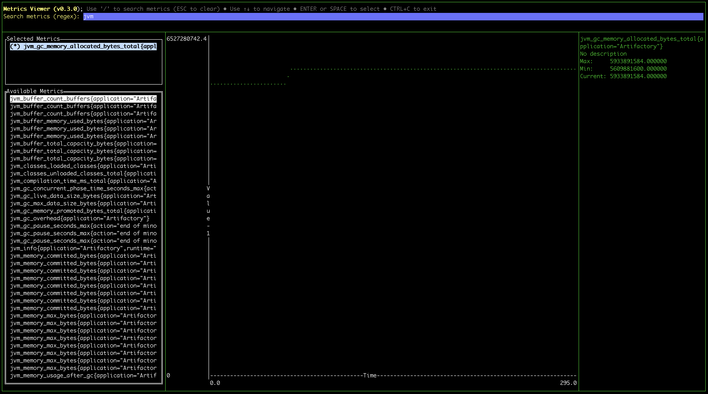
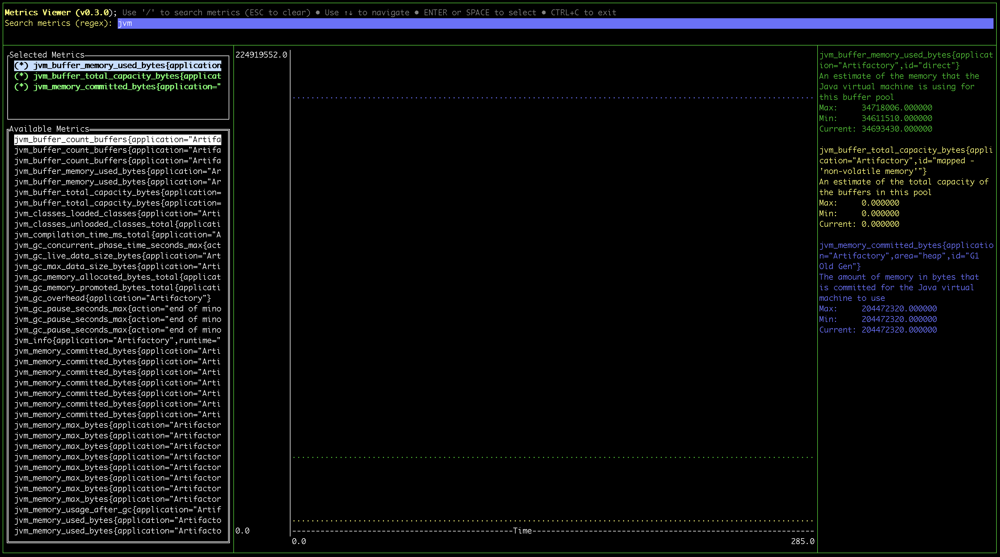

# JFrog CLI metrics-viewer Plugin
A plugin or standalone binary to show [open-metrics](https://openmetrics.io/) formatted data in a terminal based graph.



## About this plugin
This JFrog CLI plugin is for viewing JFrog products metrics in real time in a terminal. 

## Installation with JFrog CLI
Installing the latest version:
```shell
jfrog plugin install metrics-viewer
```

Installing a specific version:
```shell
jfrog plugin install metrics-viewer@version
```

Uninstalling a plugin
```shell
jfrog plugin uninstall metrics-viewer
```

## Usage
### Commands
* `metrics-viewer <commnd> [options]`
    - Commands:
    ```
    graph | g      : Open the metrics terminal graph viewer 
    print | p      : CSV formatted printout of selected metrics
    ```
    - Options:
    ```
    --file           <log-file>      : Log file with the open metrics format
    --url            <url>           : The url endpoint to get metrics
    --user           <username>      : Username for url requiring authentication
    --password       <password>      : Password for url requiring authentication
    --token          <token>         : Access token for url requiring authentication
    --artifactory    <true>          : Use current Artifactory (configured by jfrog cli with `jfrog rt c`)
    --server         <server-id>     : Select a particular server from the configured servers by jfrog cli (used only if `--artifactory true` is set) 
    --interval       <seconds>       : Scraping interval (default: 5)
    --filter         <regex>         : Regular expression to use for filtering the metrics to show
    --time           <seconds>       : Time window to show
    --metrics        <metrics>       : CSV (Comma delimited) list of metrics to show in the `print` command
    --aggregate-ignore-labels <list> : Comma delimited list of labels to ignore when aggregating metrics. Use 'ALL' or 'NONE' to ignore all or none of the labels
    ```
    - Examples:
    ```shell
    # Use with direct Artifactory metrics API URL
    ./metrics-viewer graph --url http://localhost:8082/artifactory/api/v1/metrics --user admin --password password
    
    # Use with preconfigured Artifactory (will show Artifactory metrics)
    ./metrics-viewer graph --artifactory

    # Use with direct Metadata metrics API URL (NOTE: must get an access token from Artifactory)
    ./metrics-viewer graph --url http://localhost:8082/metadata/api/v1/metrics --token ${TOKEN}

    # Print selected Artifactory metrics as CSV to STDOUT
    ./metrics-viewer print --url http://localhost:8082/artifactory/api/v1/metrics --user admin --password password \
          --metrics jfrt_runtime_heap_totalmemory_bytes,jfrt_db_connections_active_total
    ```

### Artifactory Metrics
You can run a local Docker container of Artifactory to test or demo this plugin.
 
* Start Artifactory in Docker and enable its metrics
```shell
docker run --rm -d --name artifactory \
    -p 8082:8082 \
    -e JF_ARTIFACTORY_METRICS_ENABLED=true \
    -v $(pwd)/artifactory:/var/opt/jfrog/artifactory/ docker.bintray.io/jfrog/artifactory-oss
```
* Once Artifactory is up, you can see the metrics log file or [api endpoint](https://www.jfrog.com/confluence/display/JFROG/Artifactory+REST+API#ArtifactoryRESTAPI-GettheOpenMetricsforArtifactory)
```shell
# Get the metrics from Artifactory REST API
curl -s -uadmin:password http://localhost:8082/artifactory/api/v1/metrics

# Use with direct Artifactory metrics API URL
./metrics-viewer graph --url http://localhost:8082/artifactory/api/v1/metrics --user admin --password password

```

### The Viewer
Once running, the viewer will show 3 main sections
- Left pane: List of available metrics
- Center pane: Graph of selected metrics
- Right pane: Selected metrics Max and current values 

#### Keys
- Up/Down arrow keys: Move between available metrics
- Space/Enter: Select/Deselect metric to view
- Free text: Apply text filter on available metrics
- Ctrl+C: Close **metrics-viewer**

## Release Notes
The release notes are available [here](RELEASE.md).
